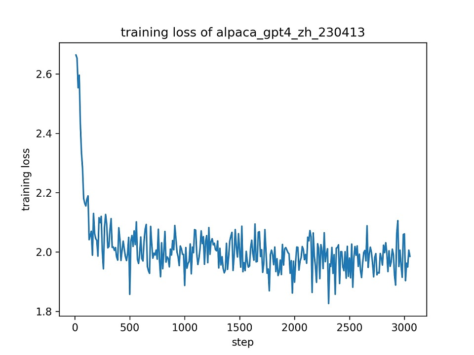

# ChatGLM Efficient Tuning

[](https://github.com/hiyouga/ChatGLM-Efficient-Tuning/stargazers)
[](LICENSE)
[](https://github.com/hiyouga/ChatGLM-Efficient-Tuning/commits/main)
[](https://pypi.org/project/glmtuner/)
[](https://github.com/hiyouga/ChatGLM-Efficient-Tuning/pulls)

基于 🤗[PEFT](https://github.com/huggingface/peft) 的高效 🤖[ChatGLM-6B](https://github.com/THUDM/ChatGLM-6B) 微调。

👋 加入我们的[微信群](assets/wechat.jpg)。

\[ [English](README.md) | 中文 \]

如果有任何疑问，请阅读我们的 [文档 📄](https://github.com/hiyouga/ChatGLM-Efficient-Tuning/wiki)。

## 公告

该项目今后**将不再维护**。请关注 **[LLaMA-Factory](https://github.com/hiyouga/LLaMA-Factory)** 大模型微调项目（包括 ChatGLM2-6B 模型）。

## 更新日志

[23/07/15] 我们开发了支持训练和测试的浏览器一键微调界面。请尝试使用 `train_web.py` 在您的浏览器中微调 ChatGLM-6B 模型。感谢 [@KanadeSiina](https://github.com/KanadeSiina) 和 [@codemayq](https://github.com/codemayq) 在该功能开发中付出的努力。

[23/07/09] 我们开源了 [FastEdit](https://github.com/hiyouga/FastEdit)⚡🩹，一个简单易用的、能迅速编辑大模型事实记忆的工具包。如果您感兴趣请关注我们的 [FastEdit](https://github.com/hiyouga/FastEdit) 项目。

[23/06/25] 我们对齐了[示例 API](src/api_demo.py) 与 [OpenAI API](https://platform.openai.com/docs/api-reference/chat) 的格式，您可以将微调模型接入任意基于 ChatGPT 的应用中。

[23/06/25] 现在我们实现了 [ChatGLM2-6B](https://github.com/THUDM/ChatGLM2-6B) 模型的微调。

[23/06/05] 现在我们实现了 4 比特的 LoRA 训练（也称 [QLoRA](https://github.com/artidoro/qlora)）。请尝试使用 `--quantization_bit 4` 参数进行 4 比特量化微调。（实验性功能）

[23/06/01] 我们开源了支持 LLaMA 和 BLOOM 系列模型的高效微调框架，如果您感兴趣请关注我们的 [LLaMA-Efficient-Tuning](https://github.com/hiyouga/LLaMA-Efficient-Tuning) 项目。

[23/06/01] 我们新增了一个使用监督微调和 RLHF 训练医疗问答模型的例子，请移步 [covid_doctor.md](examples/covid_doctor.md) 查阅。

[23/05/19] 现在我们支持了在模型训练时使用验证集评估性能。请尝试使用 `--dev_ratio` 参数指定验证集大小。

[23/04/29] 现在我们实现了 **RLHF（基于人类反馈的强化学习）** 训练！我们提供了几个运行 RLHF 的例子，具体内容请移步 `examples` 文件夹。

[23/04/25] 我们新增了一个使用自定义数据集分布式训练的例子，请移步 [ads_generation.md](examples/ads_generation.md) 查阅。

[23/04/20] 我们的项目在 12 天内获得了 100 个 Star！祝贺！

[23/04/20] 我们新增了一个修改模型自我认知的例子，请移步 [alter_self_cognition.md](examples/alter_self_cognition.md) 查阅。

[23/04/19] 现在我们实现了**模型融合**！请尝试使用 `--checkpoint_dir checkpoint1,checkpoint2` 参数训练融合 LoRA 权重后的模型。

[23/04/18] 现在可以微调**量化模型**了！请尝试使用 `quantization_bit` 参数进行 4 比特或 8 比特量化微调。

[23/04/12] 现在我们加入了**断点训练支持**！请尝试给定 `--checkpoint_dir` 参数加载指定的模型断点。

[23/04/11] 现在我们实现了**数据集组合训练**！请尝试使用 `--dataset dataset1,dataset2` 参数进行组合训练。

## 数据集

- SFT 训练：
  - [Stanford Alpaca (en)](https://github.com/tatsu-lab/stanford_alpaca)
  - [Stanford Alpaca (zh)](https://github.com/ymcui/Chinese-LLaMA-Alpaca)
  - [GPT-4 Generated Data (en&zh)](https://github.com/Instruction-Tuning-with-GPT-4/GPT-4-LLM)
  - [Open Assistant (multilingual)](https://huggingface.co/datasets/OpenAssistant/oasst1)
  - [Self-cognition (zh)](data/self_cognition.json)
  - [ShareGPT (zh)](https://huggingface.co/datasets/QingyiSi/Alpaca-CoT/tree/main/Chinese-instruction-collection)
  - [RefGPT (zh)](https://github.com/sufengniu/RefGPT)
  - [Guanaco Dataset (multilingual)](https://huggingface.co/datasets/JosephusCheung/GuanacoDataset)
  - [BELLE 2M (zh)](https://huggingface.co/datasets/BelleGroup/train_2M_CN)
  - [BELLE 1M (zh)](https://huggingface.co/datasets/BelleGroup/train_1M_CN)
  - [BELLE 0.5M (zh)](https://huggingface.co/datasets/BelleGroup/train_0.5M_CN)
  - [BELLE Dialogue 0.4M (zh)](https://huggingface.co/datasets/BelleGroup/generated_chat_0.4M)
  - [BELLE School Math 0.25M (zh)](https://huggingface.co/datasets/BelleGroup/school_math_0.25M)
  - [BELLE Multiturn Chat 0.8M (zh)](https://huggingface.co/datasets/BelleGroup/multiturn_chat_0.8M)
  - [Firefly 1.1M (zh)](https://huggingface.co/datasets/YeungNLP/firefly-train-1.1M)
  - [LIMA (en)](https://huggingface.co/datasets/GAIR/lima)
  - [CodeAlpaca 20k (en)](https://huggingface.co/datasets/sahil2801/CodeAlpaca-20k)
  - [Alpaca CoT (multilingual)](https://huggingface.co/datasets/QingyiSi/Alpaca-CoT)
  - [Web QA (zh)](https://huggingface.co/datasets/suolyer/webqa)
  - [UltraChat (en)](https://github.com/thunlp/UltraChat)
  - [WebNovel (zh)](https://huggingface.co/datasets/zxbsmk/webnovel_cn)
- 奖励模型训练：
  - [HH-RLHF (en)](https://huggingface.co/datasets/Anthropic/hh-rlhf)
  - [Open Assistant (multilingual)](https://huggingface.co/datasets/OpenAssistant/oasst1)
  - [GPT-4 Generated Data (en&zh)](https://github.com/Instruction-Tuning-with-GPT-4/GPT-4-LLM)

使用方法请参考 [data/README.md](data/README_zh.md) 文件。

部分数据集的使用需要确认，我们推荐使用下述命令登录您的 Hugging Face 账户。

```bash
pip install --upgrade huggingface_hub
huggingface-cli login
```

## 微调方法

目前我们实现了针对以下高效微调方法的支持：

- [LoRA](https://arxiv.org/abs/2106.09685)
  - 仅微调低秩适应器。
- [P-Tuning V2](https://github.com/THUDM/P-tuning-v2)
  - 仅微调前缀编码器。
- [Freeze Tuning](https://arxiv.org/abs/2012.14913)
  - 仅微调后几层的全连接层。
- 全量微调
  - 微调模型所有参数。

## 软件依赖

- Python 3.8+, PyTorch 1.13.1
- 🤗Transformers, Datasets, Accelerate, PEFT, TRL
- protobuf, cpm-kernels, sentencepiece
- jieba, rouge-chinese, nltk（用于评估）
- gradio, matplotlib（用于网页端交互）
- uvicorn, fastapi, sse-starlette（用于 API）

以及 **强而有力的 GPU**！

## 如何使用

### 数据准备（可跳过）

关于数据集文件的格式，请参考 `data/example_dataset` 文件夹的内容。构建自定义数据集时，既可以使用单个 `.json` 文件，也可以使用一个[数据加载脚本](https://huggingface.co/docs/datasets/dataset_script)和多个文件。

注意：使用自定义数据集时，请更新 `data/dataset_info.json` 文件，该文件的格式请参考 `data/README.md`。

### 环境搭建（可跳过）

```bash
git lfs install
git clone https://github.com/hiyouga/ChatGLM-Efficient-Tuning.git
conda create -n chatglm_etuning python=3.10
conda activate chatglm_etuning
cd ChatGLM-Efficient-Tuning
pip install -r requirements.txt
```

如果要在 Windows 平台上开启量化 LoRA（QLoRA），需要安装预编译的 `bitsandbytes` 库, 支持 CUDA 11.1 到 12.1.

```bash
pip install https://github.com/jllllll/bitsandbytes-windows-webui/releases/download/wheels/bitsandbytes-0.39.1-py3-none-win_amd64.whl
```

### 浏览器一键微调/测试

```bash
CUDA_VISIBLE_DEVICES=0 python src/train_web.py
```

目前网页 UI 仅支持**单卡训练**。

### 单 GPU 微调训练

```bash
CUDA_VISIBLE_DEVICES=0 python src/train_bash.py \
    --stage sft \
    --model_name_or_path path_to_your_chatglm_model \
    --do_train \
    --dataset alpaca_gpt4_zh \
    --finetuning_type lora \
    --output_dir path_to_sft_checkpoint \
    --per_device_train_batch_size 4 \
    --gradient_accumulation_steps 4 \
    --lr_scheduler_type cosine \
    --logging_steps 10 \
    --save_steps 1000 \
    --learning_rate 5e-5 \
    --num_train_epochs 3.0 \
    --plot_loss \
    --fp16
```

关于参数信息，请查阅我们的[维基](https://github.com/hiyouga/ChatGLM-Efficient-Tuning/wiki)。

### 多 GPU 分布式微调

```bash
accelerate config # 首先配置分布式环境
accelerate launch src/train_bash.py # 参数同上
```

### 奖励模型训练

```bash
CUDA_VISIBLE_DEVICES=0 python src/train_bash.py \
    --stage rm \
    --model_name_or_path path_to_your_chatglm_model \
    --do_train \
    --dataset comparison_gpt4_zh \
    --finetuning_type lora \
    --resume_lora_training False \
    --checkpoint_dir path_to_sft_checkpoint \
    --output_dir path_to_rm_checkpoint \
    --per_device_train_batch_size 4 \
    --gradient_accumulation_steps 4 \
    --lr_scheduler_type cosine \
    --logging_steps 10 \
    --save_steps 1000 \
    --learning_rate 1e-5 \
    --num_train_epochs 1.0 \
    --plot_loss \
    --fp16
```

### RLHF 训练

```bash
CUDA_VISIBLE_DEVICES=0 python src/train_bash.py \
    --stage ppo \
    --model_name_or_path path_to_your_chatglm_model \
    --do_train \
    --dataset alpaca_gpt4_zh \
    --finetuning_type lora \
    --resume_lora_training False \
    --checkpoint_dir path_to_sft_checkpoint \
    --reward_model path_to_rm_checkpoint \
    --output_dir path_to_ppo_checkpoint \
    --per_device_train_batch_size 2 \
    --gradient_accumulation_steps 4 \
    --lr_scheduler_type cosine \
    --logging_steps 10 \
    --save_steps 1000 \
    --learning_rate 1e-5 \
    --num_train_epochs 1.0 \
    --plot_loss
```

### 指标评估（BLEU分数和汉语ROUGE分数）

```bash
CUDA_VISIBLE_DEVICES=0 python src/train_bash.py \
    --stage sft \
    --model_name_or_path path_to_your_chatglm_model \
    --do_eval \
    --dataset alpaca_gpt4_zh \
    --finetuning_type lora \
    --checkpoint_dir path_to_checkpoint \
    --output_dir path_to_eval_result \
    --per_device_eval_batch_size 8 \
    --max_samples 50 \
    --predict_with_generate
```

### 模型预测

```bash
CUDA_VISIBLE_DEVICES=0 python src/train_bash.py \
    --stage sft \
    --model_name_or_path path_to_your_chatglm_model \
    --do_predict \
    --dataset alpaca_gpt4_zh \
    --finetuning_type lora \
    --checkpoint_dir path_to_checkpoint \
    --output_dir path_to_predict_result \
    --per_device_eval_batch_size 8 \
    --max_samples 50 \
    --predict_with_generate
```

注：如果需要预测的样本没有标签，请首先在 `response` 列中填入一些占位符，以免样本在预处理阶段被丢弃。

### API 服务

```bash
python src/api_demo.py \
    --model_name_or_path path_to_your_chatglm_model \
    --finetuning_type lora \
    --checkpoint_dir path_to_checkpoint
```

关于 API 文档请见 `http://localhost:8000/docs`。

### 命令行测试

```bash
python src/cli_demo.py \
    --model_name_or_path path_to_your_chatglm_model \
    --finetuning_type lora \
    --checkpoint_dir path_to_checkpoint
```

### 浏览器测试

```bash
python src/web_demo.py \
    --model_name_or_path path_to_your_chatglm_model \
    --finetuning_type lora \
    --checkpoint_dir path_to_checkpoint
```

### 导出微调模型

```bash
python src/export_model.py \
    --model_name_or_path path_to_your_chatglm_model \
    --finetuning_type lora \
    --checkpoint_dir path_to_checkpoint \
    --output_dir path_to_export
```

### 硬件需求

|     微调方法     |  批处理大小  | 模式 | GPU显存 | 速度 |
| ---------------- | ---------- | ---- | ------ | ----- |
| LoRA (r=8)       |     16     | FP16 |  28GB  | 8ex/s |
| LoRA (r=8)       |     8      | FP16 |  24GB  | 8ex/s |
| LoRA (r=8)       |     4      | FP16 |  20GB  | 8ex/s |
| LoRA (r=8)       |     4      | INT8 |  10GB  | 8ex/s |
| LoRA (r=8)       |     4      | INT4 |   8GB  | 8ex/s |
| P-Tuning (p=16)  |     4      | FP16 |  20GB  | 8ex/s |
| P-Tuning (p=16)  |     4      | INT8 |  16GB  | 8ex/s |
| P-Tuning (p=16)  |     4      | INT4 |  12GB  | 8ex/s |
| Freeze (l=3)     |     4      | FP16 |  24GB  | 8ex/s |

| 奖励模型训练方法 |  批处理大小  | 模式 | GPU显存 | 速度 |
| --------------- | ----------  | ---- | ------ | ---- |
| LoRA (r=8) + rm |      4      | FP16 |  22GB  | -    |
| LoRA (r=8) + rm |      1      | INT8 |  11GB  | -    |

|   RLHF 训练方法   |  批处理大小  | 模式 | GPU显存 | 速度 |
| ---------------- | ----------  | ---- | ------ | ---- |
| LoRA (r=8) + ppo |      4      | FP16 |  23GB  | -    |
| LoRA (r=8) + ppo |      1      | INT8 |  12GB  | -    |

> 注：`r` 为LoRA 维数大小，`p` 为前缀词表大小，`l` 为微调层数，`ex/s` 为每秒训练的样本数。`gradient_accumulation_steps` 参数设置为 `1`。上述结果均来自于单个 Tesla V100 GPU，仅供参考。

## 微调 ChatGLM 的例子

### 训练结果

我们使用整个 `alpaca_gpt4_zh` 数据集微调 ChatGLM 模型，使用秩为 8 的 LoRA 方法，使用默认超参数进行单轮训练。下图为训练损失变化曲线。



### 评估结果

我们选择 `alpaca_gpt4_zh` 数据集中的前一百条数据来评估微调后的 ChatGLM 模型，并计算 BLEU 和中文 ROUGE 分数。下表为评估结果。

|   分数  |  原版模型 | FZ (l=2) | PT (p=16) | LoRA (r=8) |
| ------- | -------- | ----- | ----- | ----------------- |
| BLEU-4  |  15.75   | 16.85 | 16.06 | 17.01 (**+1.26**) |
| Rouge-1 |  34.51   | 36.62 | 34.80 | 36.77 (**+2.26**) |
| Rouge-2 |  15.11   | 17.04 | 15.32 | 16.83 (**+1.72**) |
| Rouge-l |  26.18   | 28.17 | 26.35 | 28.86 (**+2.68**) |
| 训练参数 |  /       | 4.35% | 0.06% | 0.06%             |

> FZ：Freeze 微调，PT：P-Tuning V2 微调（为了与 LoRA 公平比较，我们使用了 `pre_seq_len=16`），训练参数：可训练参数占全部参数的百分比。

## 友情链接

- [SupritYoung/RLHF-Label-Tool](https://github.com/SupritYoung/RLHF-Label-Tool/tree/master)：一个给大模型生成结果进行排序，从而获得用于 RLHF 训练的标注数据的平台。

## 和现有类似项目的比较

- [THUDM/ChatGLM-6B](https://github.com/THUDM/ChatGLM-6B/tree/main/ptuning)
  - ChatGLM 基于 [P-Tuning v2](https://github.com/THUDM/P-tuning-v2) 微调的官方实现，使用了 [ADGEN](https://aclanthology.org/D19-1321.pdf) 数据集。
  - 本仓库的代码实现绝大部分参考该项目。我们进一步实现了 [LoRA](https://arxiv.org/abs/2106.09685) 微调方法。此外，我们**动态地**将每个批处理数据中的序列进行填充，而非将其填充到模型的最大长度，此改进可以加速模型训练。
- [mymusise/ChatGLM-Tuning](https://github.com/mymusise/ChatGLM-Tuning)
  - ChatGLM 基于 [LoRA](https://arxiv.org/abs/2106.09685) 微调的非官方实现，使用了 [Stanford Alpaca](https://github.com/tatsu-lab/stanford_alpaca) 数据集。
  - 我们借鉴了该项目的一些想法。我们的训练脚本将数据预处理部分**集成**至训练脚本中，以避免事先生成预处理后的数据。
- [ssbuild/chatglm_finetuning](https://github.com/ssbuild/chatglm_finetuning)
  - ChatGLM 基于多种微调方法的非官方实现，使用了 [Stanford Alpaca](https://github.com/tatsu-lab/stanford_alpaca) 数据集。
  - 我们的训练脚本**全部**基于 [Hugging Face transformers](https://github.com/huggingface/transformers) 框架实现，不依赖于额外的 [deep_training](https://github.com/ssbuild/deep_training) 框架。
- [lich99/ChatGLM-finetune-LoRA](https://github.com/lich99/ChatGLM-finetune-LoRA)
  - ChatGLM 基于 [LoRA](https://arxiv.org/abs/2106.09685) 微调的非官方实现，使用了 [Stanford Alpaca](https://github.com/tatsu-lab/stanford_alpaca) 数据集。
  - 我们利用 [Hugging Face PEFT](https://github.com/huggingface/peft) 框架来引入最先进的微调方法。
- [liucongg/ChatGLM-Finetuning](https://github.com/liucongg/ChatGLM-Finetuning)
  - ChatGLM 基于参数冻结、LoRA 和 P-Tuning 微调的非官方实现，使用了汽车工业数据集。
  - 我们旨在引入更多指令遵循数据集用于微调 ChatGLM 模型。
- [yanqiangmiffy/InstructGLM](https://github.com/yanqiangmiffy/InstructGLM)
  - ChatGLM 微调的非官方实现，旨在探索 ChatGLM 在指令遵循数据集上的潜力。
  - 我们将数据预处理部分集成到训练脚本中。

## TODO

- [ ] 利用 [LangChain](https://github.com/hwchase17/langchain) 实现能够利用外部知识的基于 ChatGLM 微调模型应用的轻松构建。
- [ ] 实现对齐算法使模型对齐人类意图。
  - [x] [RLHF](https://github.com/microsoft/DeepSpeed/tree/master/blogs/deepspeed-chat)
  - [ ] [RRHF](https://github.com/GanjinZero/RRHF)
  - [ ] [RAFT](https://github.com/OptimalScale/LMFlow)
- [ ] 加入更多[中文数据集](https://github.com/brightmart/nlp_chinese_corpus)。
  - [x] [BELLE](https://github.com/LianjiaTech/BELLE)
  - [ ] [pCLUE](https://github.com/CLUEbenchmark/pCLUE)
  - [ ] [CLUECorpus](https://github.com/CLUEbenchmark/CLUECorpus2020)
  - [x] [GuanacoDataset](https://huggingface.co/datasets/JosephusCheung/GuanacoDataset)
  - [x] [FireflyDataset](https://huggingface.co/datasets/YeungNLP/firefly-train-1.1M)
- [ ] 加入基于 [ChatGPT](https://openai.com/blog/chatgpt) 和 [GPT-4](https://openai.com/research/gpt-4) 产生的数据集。
  - [ ] [Baize](https://github.com/project-baize/baize-chatbot)
  - [x] [GPT-4-LLM](https://github.com/Instruction-Tuning-with-GPT-4/GPT-4-LLM)
- [x] 实现参数冻结和 P-Tuning 微调方法。
- [x] 支持多GPU训练。
- [x] 加入模型评估脚本。
- [x] 断点加载。
- [x] 量化微调。
- [x] 撰写基于该框架的 ChatGLM 模型微调指南手册。
- [ ] 结合模型编辑技术。（例如：[MEND](https://arxiv.org/abs/2110.11309)）
- [x] 加入 [OpenAssistant 对话数据集](https://huggingface.co/datasets/OpenAssistant/oasst1)用于监督微调和意图对齐。
- [ ] 加入高质量中文开源指令数据集 [COIG](https://huggingface.co/datasets/BAAI/COIG)。

## 协议

本仓库的代码依照 [Apache-2.0](LICENSE) 协议开源。ChatGLM-6B 模型的使用请遵循[模型协议](https://github.com/THUDM/ChatGLM-6B/blob/main/MODEL_LICENSE)。

## 引用

如果您觉得此项目有帮助，请考虑以下列格式引用

```bibtex
@Misc{chatglm-efficient-tuning,
  title = {ChatGLM Efficient Tuning},
  author = {hiyouga},
  howpublished = {\url{https://github.com/hiyouga/ChatGLM-Efficient-Tuning}},
  year = {2023}
}
```

## 声明

本项目受益于 [ChatGLM-6B](https://github.com/THUDM/ChatGLM-6B)、[ChatGLM-Tuning](https://github.com/mymusise/ChatGLM-Tuning) 和 [yuanzhoulvpi2017/zero_nlp](https://github.com/yuanzhoulvpi2017/zero_nlp)，感谢以上诸位作者的付出。

## Star History


