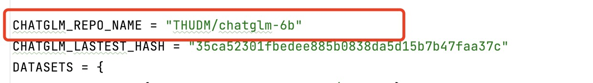

# 基于本框架的快速微调chatGLM的简易步骤


👋 **加入我们的[微信群](assets/wechat.jpg)。**

\[ [English](README_fine_tune_EN.md) | 中文 \]

## 更新日志

[23/04/19] 我们补充了基于本框架的微调简易步骤供参考。

# 微调步骤

## **1.依赖环境预安装：**

建议使用conda或者pipenv等虚拟环境安装依赖，能尽最大限度不影响系统配置并管理项目依赖的环境包，以下以conda为例子

```bash
git clone https://github.com/hiyouga/ChatGLM-Efficient-Tuning.git
conda create -n cet python=3.10
conda activate cet
cd ChatGLM-Efficient-Tuning
pip install -r requirements.txt
```

**本项目默认会联网获取最新的chatGLM模型相关文件，因为模型版本可能影响代码效果甚至报错，建议使用官方最新的模型版本文件，如自身网络不佳偶尔会出现connection time out等现象（毕竟huggingface墙内不能保证网速），请尝试先离线下载官方模型保存到本地**

然后修改config.py文件的CHATGLM_REPO_NAME路径地址为本地离线下载的模型文件地址如图所示：



## 2.**数据集准备：**

本项目支持多种主流的数据集种类帮助用户节省找寻数据集测试的时间（数据规模只是初步统计，数据集跟随源仓库可能更新）：

| 数据集名称                                                   | 规模（估算） | 描述                                                         |
| ------------------------------------------------------------ | ------------ | ------------------------------------------------------------ |
| [Stanford Alpaca](https://github.com/tatsu-lab/stanford_alpaca) | 52k          | 斯坦福大学开源的alpaca数据集，训练了alpaca这类早期基于LLaMA的模型 |
| [Stanford Alpaca (Chinese)](https://github.com/ymcui/Chinese-LLaMA-Alpaca) | 51k          | 针对原版LLaMA模型扩充了中文词表                              |
| [GPT-4 Generated Data](https://github.com/Instruction-Tuning-with-GPT-4/GPT-4-LLM) | 100k+        | 基于GPT4.0的self-instruction数据集                           |
| [BELLE 2M](https://huggingface.co/datasets/BelleGroup/train_2M_CN) | 2M           | 包含约200万条由[BELLE](https://github.com/LianjiaTech/BELLE)项目生成的中文指令数据 |
| [BELLE 1M](https://huggingface.co/datasets/BelleGroup/train_1M_CN) | 1M           | 包含约100万条由[BELLE](https://github.com/LianjiaTech/BELLE)项目生成的中文指令数据。 |
| [BELLE 0.5M](https://huggingface.co/datasets/BelleGroup/train_0.5M_CN) | 0.5M         | 包含约50万条由[BELLE](https://github.com/LianjiaTech/BELLE)项目生成的中文指令数据。 |
| [BELLE Dialogue 0.4M](https://huggingface.co/datasets/BelleGroup/generated_chat_0.4M) | 0.4M         | 包含约40万条由[BELLE](https://github.com/LianjiaTech/BELLE)项目生成的个性化角色对话数据，包含角色介绍。注意**此数据集是chatGPT产生的数据集，不保证数据准确性**。所有类GPT模型产生的self-instruction都不能保证准确率。 |
| [BELLE School Math 0.25M](https://huggingface.co/datasets/BelleGroup/school_math_0.25M) | 0.25M        | 包含约25万条由[BELLE](https://github.com/LianjiaTech/BELLE)项目生成的中文数学题数据，包含解题过程 |
| [BELLE Multiturn Chat 0.8M](https://huggingface.co/datasets/BelleGroup/multiturn_chat_0.8M) | 0.8M         | 包含约80万条由[BELLE](https://github.com/LianjiaTech/BELLE)项目生成的*用户*与*助手*的多轮对话 |
| [Guanaco Dataset](https://huggingface.co/datasets/JosephusCheung/GuanacoDataset) | 100k+        | 包含日文、简繁体中文、英文等多类数据，数据集原用于Guanaco模型训练。 |
| [Firefly 1.1M](https://huggingface.co/datasets/YeungNLP/firefly-train-1.1M) | 1.1M         | 中文对话大模型firefly（流萤）的中文数据集，对于每个任务，由人工书写若干种指令模板 |

用户可以下载以上数据集保存到data目录下，然后修改src/config.py文件新增数据集的信息进行模型微调

数据集格式类似如下：


必填项：**instruction、output.**

选填项：history，如数据场景涉及多轮会话上下文联系的，建议采用高质量history多轮会话数据集，history默认可以为空，传入空数组[]即可。

**Tips：**

​		 2.1.很多用户上手微调的第一个小实验都是从训练模型改变自我身份的回答开始，例如问模型身份是谁这类场景，需要特别注意，这种针对单类问题回答又要求相对较高的场合，需要数据集里面保持一定比例的关于自身问题的对话，一般我们建议不低于数据集的5%，且问答内容尽量保持一定差异，这样让模型能充分学习到自我认知的回答。

​		2.2.如果用户自定义数据集，请尽量把数据集转换为json文件，方便后面对齐文本操作。

## 3.执行微调程序

切换到**src/finetune.py**目录下，此文件是微调主程序文件，到此目录下执行python命令

​	**本项目支持单台单GPU与单台多GPU微调**

**单GPU**调用命令参数如下：

```bash
CUDA_VISIBLE_DEVICES=1 python finetune.py  \
		--do_train \
		--dataset instruct_ch\     
    --finetuning_type lora \
    --output_dir output/0418-02 \
    --per_device_train_batch_size 4 \
    --gradient_accumulation_steps 4 \
    --lr_scheduler_type cosine \
    --logging_steps 10 \
    --save_steps 1000 \
    --learning_rate 1e-4 \
    --num_train_epochs 1.0 \
    --fp16
		#注意python finetune_chatglm.py执行的时候，需要指定自己环境里面 python路径，当然如果是根据上面使用conda之类的虚拟环境就不			必在意这个问题了。
    #CUDA_VISIBLE_DEVICES参数可以默认不传，以下例子传了1指定序号1的本机GPU运行程序，也可以是0或者其他序号的GPU
    #主要参数解释：
    #							--dataset 是数据集名称，此处数据集名称要与config.py里面自定义的数据集名称相同
    #                   支持多个数据集同时导入，格式类似 --dataset instruct_ch,instruct_ch2,instruct_ch3......
    #							--finetuning_type 表示微调方法，目前本项目单GPU支持LoRA、freeze、ptuning三种方法，对应名称修改就行
    #							--output_dir为模型输出结果目录，断点续训练也是需要指定checkpoint地址从这边开始
    #							--per_device_train_batch_size 每批次样本数量，显存越小建议batchsize调低。
    #							--lr_scheduler_type 支持liner跟cosine两种方式，用户自行选择自己所属场景测试哪种合适。
    #							--logging_steps 日志记录的step间隔数，如果不想debug，建议增大记录步数，减少IO读写
    #							--learning_rate 学习曲率，根据自身需求可以弹性调节。
    #							--num_train_epochs epoch的数目，如果模型欠拟合数据集较大可以适当调高，用户应根据训练结果是过拟合或者欠拟合结										果来调整。
    #							--fp16 表示了量化精度，支持16,8,4三种精度，根据本机的性能配置，如果出现cuda out of memory之类错误的建议不										使用16，调低到8或者4逐步尝试尽量用完自己的机器性能
    
   
```

以上传参如果觉得每次都要命令行输入太多太麻烦，还可以通过修改bash脚本**examples/finetune.sh**文件，通过脚本文件的修改只需要执行sh ./finetune.sh亦可进行调参。

**多GPU加速微调**

```bash
accelerate launch finetune.py  \
		--do_train \
		--dataset instruct_ch\     
    --finetuning_type freeze \
    --output_dir output/0418-02 \
    --per_device_train_batch_size 4 \
    --gradient_accumulation_steps 4 \
    --lr_scheduler_type cosine \
    --logging_steps 10 \
    --save_steps 1000 \
    --learning_rate 1e-4 \
    --num_train_epochs 1.0 \
    --fp16
    #参数含义同上单GPU，注意目前多GPU模式暂不支持LoRA方法，推荐先采用freeze方法，一样提高约一倍的训练效率
```


## **4.使用新微调后的模型**

```bash
CUDA_VISIBLE_DEVICES=0 python infer_chatglm.py --checkpoint_dir chatglm_efficient_tuning/output/0418-02/

可以指定使用哪块GPU运行推理文件，checkpoint目录要改成上面微调后保存的output下目录地址

```

成功运行后的界面如下所示：


注意会话多轮后占用计算资源会增加，根据自身场景需求与机器配置使用。

部署可视化界面：

如果用户想复用chatGLM官方的Gradio前端界面运行本框架微调后的代码也行：

```python
from utils	import utils, arguments #根据自己安装的本框架目录适当调整from的utils文件夹位置导入utils跟arguments
    model_path="chatglm_efficient_tuning/output/0417/"
    model_args=ModelArguments(checkpoint_dir=model_path)
    model, tokenizer = load_pretrained(model_args)
    model = model.half().cuda()
```

python webdemo.py运行后既能复用官方可视化界面又能基于本框架微调后的模型进行测试。


## 协议

本仓库的代码依照 [Apache-2.0](LICENSE) 协议开源。

## 引用

如果您觉得此项目有帮助，请考虑以下列格式引用

```bibtex
@Misc{chatglm-efficient-tuning,
  title = {ChatGLM Efficient Tuning},
  author = {hiyouga},
  howpublished = {\url{https://github.com/hiyouga/ChatGLM-Efficient-Tuning}},
  year = {2023}
}
```

## 声明

本项目受益于 [ChatGLM-6B](https://github.com/THUDM/ChatGLM-6B)、[ChatGLM-Tuning](https://github.com/mymusise/ChatGLM-Tuning) 和 [yuanzhoulvpi2017/zero_nlp](https://github.com/yuanzhoulvpi2017/zero_nlp)，感谢作者的付出。
