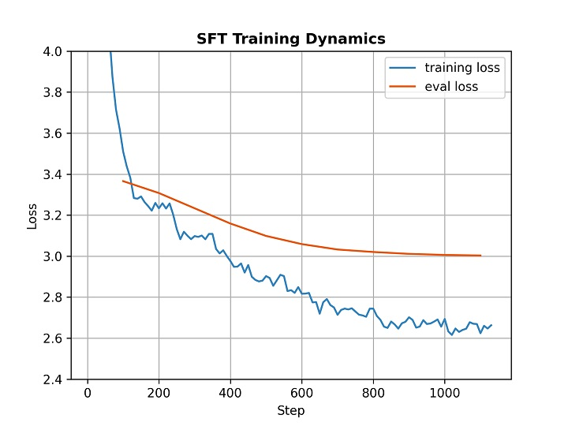
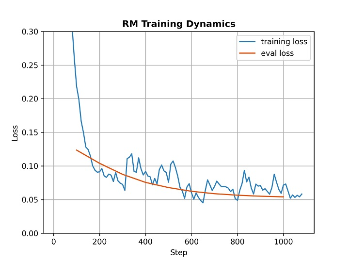
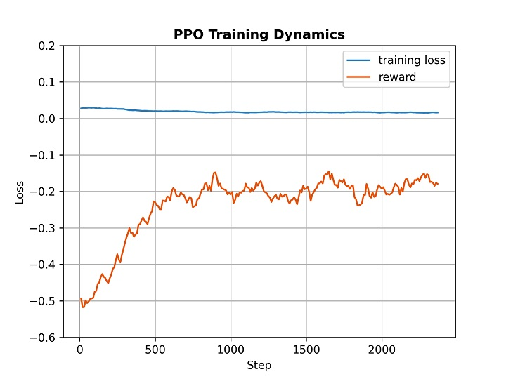
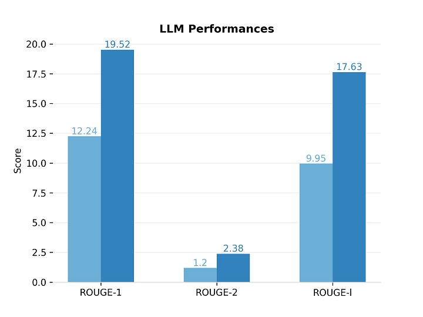
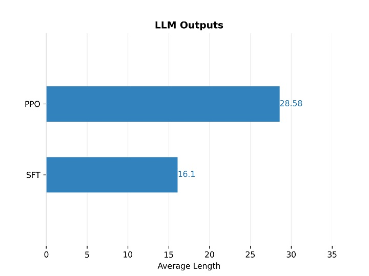
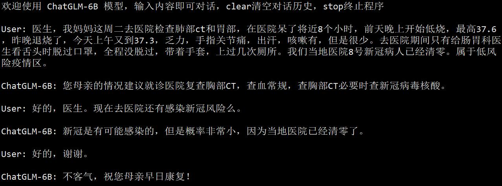
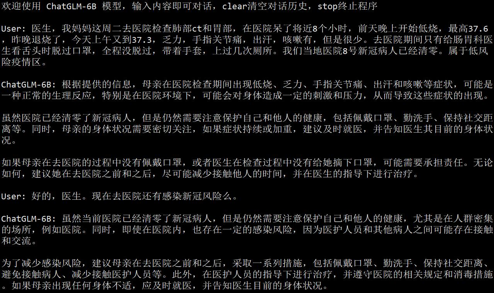
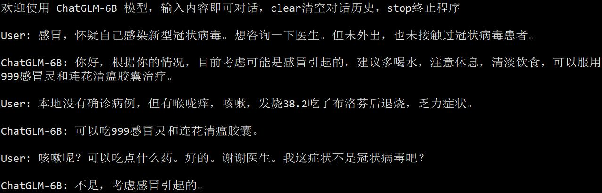
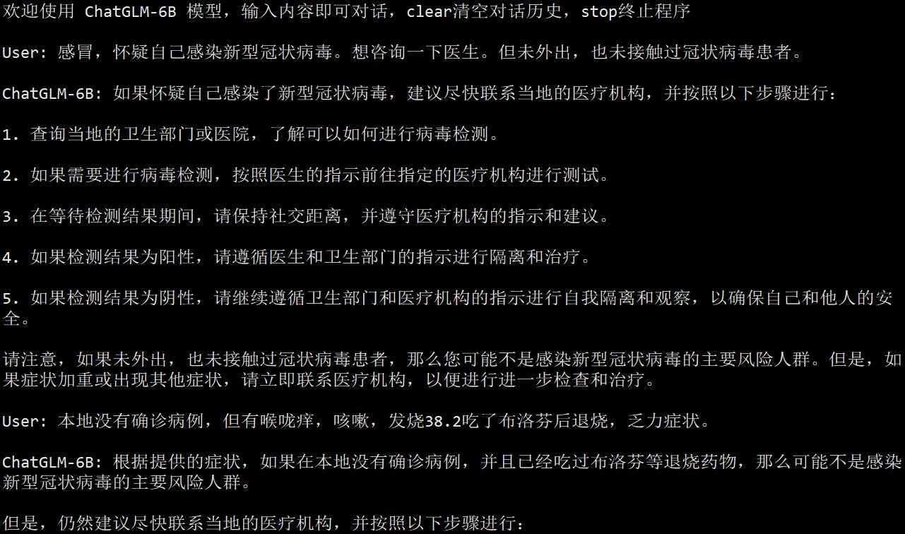

# 使用医患对话数据训练新冠诊疗模型的例子

> 本案例目的仅在于介绍利用项目框架进行 SFT+RLHF 的模型微调流程，微调结果不用于任何商业目的，且不保证模型的可靠性。

## 一、环境配置

基本环境配置请参照[此案例](alter_self_cognition.md)。
|   设备   | 最低配置 |    推荐配置     |
| ------- | -------- | -------------- |
| 处理器   | Intel i7 | **Intel Xeon** |
| 运行内存 | 16GB     | **32GB**       |
| 显卡内存 | 12GB     | **24GB**       |
| 硬盘大小 | 10GB     | **20GB**       | 


## 二、数据集准备

在本案例中，我们使用了 Ju 等人提供的中文医患对话数据集 [COVID-Dialogue-Dataset-Chinese](https://github.com/UCSD-AI4H/COVID-Dialogue)，该数据集收集了“[好大夫在线](https://www.haodf.com)”网站上的 1300 余条有关新型冠状病毒肺炎（COVID-19）的医患对话文本。我们的目的是根据这些对话文本微调 ChatGLM-6B 模型，使其能够模仿医生，对患者的问题进行自动诊断和答复。

我们对项目中预先分割好的训练集、验证集和测试集进行二次处理，具体地讲，我们将原数据集的多轮对话样本中的每个轮次都提取作为一个样本，从而构建新的训练集、验证集和测试集。新的数据集中包含 3471 条训练样本，333 条验证样本和 410 条测试样本。您可以从[这里](media/covid.zip)下载我们预处理好的数据集，并将其解压至 `data` 文件夹中，解压后的文件目录如下所示：

```
data/
├── xxx
└── covid/
   ├── train.json
   ├── validate.json
   ├── test.json
   └── dataset_info.json
```

### 三、模型监督微调

运行以下命令使用训练集和验证集对模型进行监督微调，这里利用了 LoRA 微调方法，微调后的模型保存在 `covid/sft` 文件夹中。我们采用 5e-5 的学习率，批处理大小为 4×8=32，在训练样本上训练 10 个 epoch。另外，我们使用 5% 的训练样本作为验证样本，用于观察模型是否过拟合。
注：24G显存大小需把--per_device_train_batch_size改成2或更低，不然会超显存。

```bash
CUDA_VISIBLE_DEVICES=0 python src/train_sft.py \
    --do_train \
    --dataset covid_train,covid_dev \
    --dataset_dir data/covid \
    --finetuning_type lora \
    --output_dir covid/sft \
    --overwrite_cache \
    --per_device_train_batch_size 4 \
    --per_device_eval_batch_size 4 \
    --gradient_accumulation_steps 8 \
    --max_source_length 1024 \
    --max_target_length 128 \
    --lr_scheduler_type cosine \
    --logging_steps 10 \
    --save_steps 100 \
    --eval_steps 100 \
    --learning_rate 5e-5 \
    --num_train_epochs 10.0 \
    --dev_ratio 0.05 \
    --evaluation_strategy steps \
    --load_best_model_at_end \
    --plot_loss \
    --fp16
```

如果需要在多个 GPU 上进行分布式训练，只需要将上面的 `CUDA_VISIBLE_DEVICES=0 python` 改为 `accelerate launch` 即可，下面同理。

在监督微调阶段，模型在训练样本和验证样本上的损失变化曲线如下图所示。



## 四、奖励模型训练

为了进行后续的强化学习训练，我们需要先训练一个奖励模型。这里我们使用项目中自带的中文对比数据集 `comparison_gpt4_zh` 训练奖励模型，模型训练利用了 LoRA 方法，奖励模型的 LoRA 权重保存在 `covid/rm` 文件夹中。我们采用 1e-5 的学习率，批处理大小为 4×8=32，在训练样本上训练 1 个 epoch。另外，我们使用 5% 的训练样本作为验证样本，用于观察模型是否过拟合。

```bash
CUDA_VISIBLE_DEVICES=0 python src/train_rm.py \
    --do_train \
    --dataset comparison_gpt4_zh \
    --dataset_dir data \
    --finetuning_type lora \
    --output_dir covid/rm \
    --overwrite_cache \
    --per_device_train_batch_size 4 \
    --per_device_eval_batch_size 4 \
    --gradient_accumulation_steps 8 \
    --max_source_length 512 \
    --max_target_length 512 \
    --lr_scheduler_type cosine \
    --logging_steps 10 \
    --save_steps 100 \
    --eval_steps 100 \
    --learning_rate 1e-5 \
    --num_train_epochs 1.0 \
    --dev_ratio 0.05 \
    --evaluation_strategy steps \
    --load_best_model_at_end \
    --plot_loss \
    --fp16
```

在奖励模型训练阶段，模型在训练样本和验证样本上的损失变化曲线如下图所示。



## 五、强化学习训练

利用先前训练得到的监督微调模型和奖励模型，运行以下命令对模型进行强化学习训练。在强化学习过程中，我们需要加载 `covid/sft` 文件夹中存放的监督微调模型，以及 `covid/rm` 文件夹中存放的奖励模型。我们使用训练集和验证集，利用 LoRA 方法和 PPO 算法对模型进行强化学习训练，训练后的模型保存在 `covid/ppo` 文件夹中。我们采用 1e-5 的学习率，批处理大小为 2×4=8，在训练样本上训练 5 个 epoch。由于强化学习训练会消耗更多的显存，为了避免显存溢出，我们设置最大源序列长度为 256，而非监督微调阶段的 1024。

> 请注意，在强化学习训练时，我们需要额外添加参数 `--resume_lora_training False`。这是因为 TRL 库会将卸载 LoRA 权重的模型作为 PPO 算法中的参考模型（ref_model）。因此我们需要创建一个新的 LoRA 权重，使得参考模型为我们的监督微调模型。否则，若该项设置为默认的 `True`，PPO 算法会将原始的 ChatGLM-6B 作为参考模型，这会导致强化学习后的模型会退化到原始 ChatGLM-6B 模型，使我们的监督微调模型失效。
> 
> 尽管如此，该项仍然允许设置为 `True`。当采用这种设置时，我们相当于给监督微调后的模型做正则化（regularization）过程。由于 PPO 算法中的 KL 散度惩罚项，这时强化学习训练相当于在减轻监督微调过程中的过拟合现象。如果您对 RLHF 算法有充分的了解，我们建议您自由探索该参数的最佳设置。

```bash
CUDA_VISIBLE_DEVICES=0 python src/train_ppo.py \
    --do_train \
    --dataset covid_train,covid_dev \
    --dataset_dir data/covid \
    --finetuning_type lora \
    --checkpoint_dir covid/sft \
    --reward_model covid/rm \
    --output_dir covid/ppo \
    --overwrite_cache \
    --per_device_train_batch_size 2 \
    --gradient_accumulation_steps 4 \
    --max_source_length 256 \
    --max_target_length 128 \
    --lr_scheduler_type cosine \
    --logging_steps 10 \
    --save_steps 100 \
    --learning_rate 1e-5 \
    --num_train_epochs 5.0 \
    --resume_lora_training False \
    --plot_loss
```

在强化学习训练阶段，模型的训练损失和奖励变化曲线如下图所示。



## 六、模型评估

我们使用训练后的模型在测试集上进行预测，同时评估模型在测试集上的 BLEU 和 ROUGE 分数，预测结果会保存在 `covid/pred/generated_predictions.jsonl` 文件中。由于强化学习阶段创建了新的 LoRA 权重，因此我们要同时加载监督微调阶段和强化学习阶段的 LoRA 权重。

```bash
CUDA_VISIBLE_DEVICES=0 python src/train_sft.py \
    --do_predict \
    --dataset covid_test \
    --dataset_dir data/covid \
    --checkpoint_dir covid/sft,covid/ppo \
    --output_dir covid/pred \
    --overwrite_cache \
    --per_device_eval_batch_size 4 \
    --max_source_length 1024 \
    --max_target_length 128 \
    --predict_with_generate
```

下图对比了原始 ChatGLM-6B 模型和监督微调模型在测试集上的 ROUGE 分数，可以看出，监督微调后的模型在领域数据上的表现超过了原始模型。



尽管监督微调模型在数据集上表现更好，但由于数据集质量不高，它往往会产生很短的回复，我们期望它能给出更详细的回答。因此在 RLHF 阶段，我们的目的是让模型输出更长的句子。下图对比了监督微调（SFT）模型和强化学习（PPO）模型产生的句子平均长度。可以看出，PPO 模型的回复长度显著优于 SFT 模型。



## 七、模型测试

运行以下命令在单个 GPU 上测试模型效果，它会加载 `covid/sft` 和 `covid/ppo` 文件夹内保存的微调模型权重，并合并进原版 ChatGLM-6B 模型的参数权重中，同时启动流式交互窗口。

```bash
CUDA_VISIBLE_DEVICES=0 python src/cli_demo.py \
    --checkpoint_dir covid/sft,covid/ppo
```

我们挑选了数据集中的一些真实患者问题对微调后的模型进行测试，由下图可以看出训练后的模型可以模拟医生的语气对患者的问题进行答复。



与此相对，原版 ChatGLM-6B 模型只能产生相对笼统的答复，难以向患者给出有建设性的建议，如下图所示。



在训练过程中，我们也给模型注入了领域知识，例如训练后的模型还可能给出用药建议。



而原版 ChatGLM-6B 模型的回复同样比较笼统。



总而言之，在本案例中，我们提供了一套完整的 ChatGLM-6B 微调流程，包括监督微调、奖励模型训练和强化学习训练。由于时间和资源有限，本案例并没有特别注重模型效果提升，而只是提供一个方法流程。具体该如何使用领域数据集通过微调提升大型语言模型效果，还有待各位读者的亲自探索和验证。
