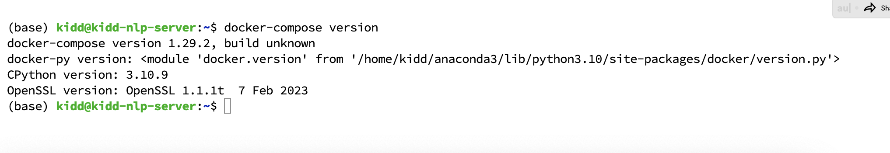

# 使用docker与docker-compose例子

为了让用户更便捷启动项目，我们准备了docker与docker-compose方式快速上手项目，采用docker-compose是为了方便用户既能在物理机调试项目，又能迅速映射物理机文件到docker容器内部路径实现物理机调试代码，docker容器内运行，解决环境依赖于配置的问题。

## 一、环境配置
需要先安装docker与docker-compose（本案例以ubuntu为例）

```bash
$ sudo apt update
$ sudo apt install -y ca-certificates curl gnupg lsb-release
```
启用官方存储库

```bash
$ curl -fsSL https://download.docker.com/linux/ubuntu/gpg | sudo gpg --dearmor -o /usr/share/keyrings/docker-archive-keyring.gpg
$ echo "deb [arch=$(dpkg --print-architecture) signed-by=/usr/share/keyrings/docker-archive-keyring.gpg] https://download.docker.com/linux/ubuntu $(lsb_release -cs) stable" | sudo tee /etc/apt/sources.list.d/docker.list > /dev/null
```

使用apt命令安装docker

```bash
$ sudo apt-get update
$ sudo apt install docker-ce docker-ce-cli containerd.io -y
```

docker 包安装完成后，请将本地用户加入 docker 组，以便该用户无需 sudo 即可执行 docker 命令

```bash
$ sudo usermod -aG docker $USER
$ newgrp docker
```

通过执行以下命令验证 docker 版本

```bash
$ docker version
```


安装docker-compose

```bash
$ pip install docker-compose
```

查看docker-compose是否安装完毕



## 二、启动容器

在启动容器之前，请先修改[docker-compose.yml](./docker/docker-compose.yml)文件里面的volumes路径，volumes用于将物理主机里的目录映射到docker虚拟机里

”volumes："配置里面冒号左侧为本地物理机实际存放项目代码的路径，右侧为映射入容器的项目路径，这样做的好处是调试本地代码的时候不用频繁切换入容器，且能实时同步修改的代码到容器环境中。

修改红框内路径改为本地物理机的项目实际路径


下一步我们切换到docker目录下执行"docker-compose"命令

```bash
$ docker-compose up
```

该命令会自动匹配目录下的[docker-compose.yml](./docker/docker-compose.yml)文件，并执行，即可看到自动拉取docker镜像（如果pull太慢，可以尝试换docker镜像国内地址）


下载完成后会自动运行改容器，此时另外新开一个窗口执行以下命令可查看容器运行状态：

```bash
$ docker ps
```


执行docker exce命令进入容器：

```bash
$ docker exec -it {容器的ID} /bin/bash
```


## 三、运行容器
进入容器后就能切换到/home/的默认目录下（上面已经在[docker-compose.yml](./docker/docker-compose.yml)文件指定了映射路径）

然后容器内执行conda命令（我们尽量保留容器内的conda 环境让用户可以在本容器里继续创建别的conda环境做测试）

```bash
$ conda activate chatglmeft
```


下载离线模型文件
在容器内切换到/examples/docker/目录下，执行download_models脚本文件
```bash
$ python download_models.py
```
使用离线模型有3个原因：

1.在MacOS系统中chatGLM模型只能加载本地模型才能兼容运行(详见chatGLM官方说明)

2.因为docker容器是虚拟化的，如果容器销毁，下载的模型文件如果不物理持久化也会随着容器销毁，所以我们采用docker-compose映射物理机路径的方式持久化离线保存

3.我们尽量不封装模型到容器里面，防止官方模型文件更新，容器更新不及时与代码不兼容，同时也减少了容器的体积。


进入容器内部的项目目录就能执行各种脚本与测试，如下执行推理脚本（python infer.py）：


**关于docker-compose的特别提示**：

[docker-compose.yml](./docker/docker-compose.yml)文件的deploy配置了一些物理机NVIDIA显卡信息，在有NVIDIA显卡的环境可以开启（mac等AMD机器忽略此项），配置项"count：2"意思是使用物理机的2块显卡，如果有n块就写n。
这样做的考虑是，在容器内最灵活的控制使用几块显卡资源，让用户自行决定哪些显卡需要分配哪些容器，docker-compose本身也支持管理多个容器实例化，用户可以起多个容器，实现多个模型并行服务。

